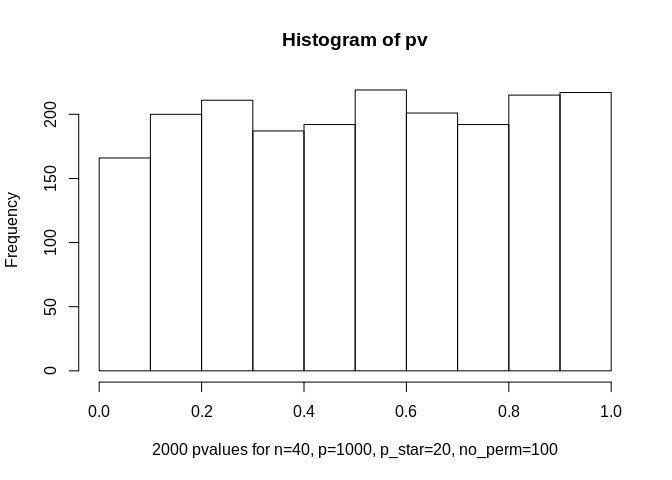

-   [Question 1.1](#question-1.1)
    -   [function: data\_gen\_fm](#function-data_gen_fm)
    -   [function: pv\_lm\_select](#function-pv_lm_select)
    -   [Explain:](#explain)
    -   [function: test\_pv\_lm\_select](#function-test_pv_lm_select)
    -   [Explain:](#explain-1)
-   [Question 1.2](#question-1.2)
    -   [Explain:](#explain-2)
-   [Question 2](#question-2)
    -   [Inverting-CDF method](#inverting-cdf-method)
    -   [function: gen\_fx](#function-gen_fx)
    -   [function: fx](#function-fx)
    -   [Comparison](#comparison)
    -   [Explain:](#explain-3)

Question 1.1
------------

### function: data\_gen\_fm

``` r
#use method of inverse cdf to generate iid sample from exp(1/2)
gen_exp0.5<-function(n)
{
  u<-runif(n)
  -2*log(1-u)
}

#use method of inverse cdf to generate iid sample from normal(0,1)
gen_normal<-function(n)
{
  n1<-ceiling(n/2)
  theta<-runif(n1,0,2*pi)
  R<-sqrt(gen_exp0.5(n1))
  x<-R*sin(theta)
  y<-R*cos(theta)
  c(x,y)[1:n]
}

#generate a data set from factor analysis model: (Y,X)=Z*T+E
#T: Given parameters, k*(p+1) matrix
#Z: Data of the factors, n*k matrix
#E: Noise term, n*(p+1) matrix
data_gen_fm<-function(T,n,p,k)
{
  if (n<=0 || p<=0 || k<0)
  {stop("Invalid argument, not satisfy n>0, p>0 or k>=0")
  }
  if (k>0)
  {
    Z<-matrix(gen_normal(n*k),n,k)
    E<-matrix(gen_normal(n*(p+1)),n,(p+1))
    YX<-Z%*%T+E
  }else{
    E<-matrix(gen_normal(n*(p+1)),n,(p+1))
    YX<-E
  }
  
  list(Y=YX[,1],X=YX[,-1],YX=YX)
}
```

### function: pv\_lm\_select

``` r
#Select p_star features and then fits a linear model, return p-value based on F-statistic
#YX: Data set
#p_star: the number of selected features
pv_lm_select<-function(YX,p_star)
{
  if (p_star<=0)
  {stop("Invalid argument")
  }
  
  cor<-abs(cor(YX[,1],YX))
  ix<-sort(cor,decreasing = TRUE, index.return = TRUE)$ix[1:(p_star+1)]
  d<-data.frame(YX[,ix])
  Y<-d[,1]
  d1<- data.frame(Y,d[,-1])
  fit.lm<-lm(d1$Y ~ .,data = d1)
  fvalue<-summary(fit.lm)$fstatistic
  
  1-pf(fvalue[1],fvalue[2],fvalue[3])
}

#simulations: get a p-value with T=0
N<-2000;n<-40;p<-1000;p_star<-20;k<-0
pv_lm_select(data_gen_fm(0,n,p,0)$YX,p_star)
```

    ##       value 
    ## 9.77428e-07

### Explain:

The p-value for the model after selecting p\_star features is very
small, so the model is significant. On the other hand, the selected
features have the hightest correlation with y, which explains why the
model is significant.

### function: test\_pv\_lm\_select

``` r
#use data_gen_fm to generate N data sets;
#use pv_lm_select to compute the p-values; 
#draw histogram of these N p-values
test_pv_lm_select<-function(N,n,p,p_star)
{
  A<-array(0,dim = c(n,p+1,N))
  pv<-rep(0,N)
  for (i in 1:N) {
    A[,,i]<-data_gen_fm(0,n,p,0)$YX
    pv[i]<-pv_lm_select(A[,,i],p_star)
  }
    hist(pv,xlab="2000 pvalues for n=40, p=1000, p_star=20")
}

#simulations
N<-2000;n<-40;p<-1000;p_star<-20;k<-0
test_pv_lm_select(N,n,p,p_star)
```


### Explain:

The p-values for the model after selecting p\_star features with N data
sets are very small, so the models are significant (because the selected
features have the largest absolute correlations with y). It violates the
uniformity of p-values of fitting a linear model with selected
variables.

Question 1.2
------------

``` r
#no_perm: number of permutations for y
#permute y no_perm times; 
#for each permuted data set, get the p-value from lm
pv_lm_select_perm<-function(YX,p_star,no_perm)
{
  if (p_star<=0 || no_perm<=0)
  {stop("Invalid argument")
  }
  pv1<-pv_lm_select(YX,p_star)
    
  index <- 0
  for (i in 1:no_perm) {
    YX2<-data.frame(sample(YX[,1]),YX[,-1])
    pv2 <- pv_lm_select(YX2,p_star)
    if ( pv2 <= pv1){
      index <- index+1 
    }
  }
  (index+1)/(no_perm+1)
}

#simulations
N<-2000;n<-40;p<-1000;p_star<-20;k<-0;no_perm<-100
pv_lm_select_perm(data_gen_fm(0,n,p,0)$YX,p_star,no_perm)
```

    ## [1] 0.2970297

``` r
#use data_gen_fm to generate N data sets;
#use pv_lm_select_perm to compute the p-values; 
#draw histogram of these N p-values
test_pv_lm_select_p<-function(N,n,p,p_star,no_perm)
{
  A<-array(0,dim = c(n,p+1,N))
  pv<-rep(0,N)
  for (i in 1:N) {
    A[,,i]<-data_gen_fm(0,n,p,0)$YX
    pv[i]<-pv_lm_select_perm(A[,,i],p_star,no_perm)
  }
  hist(pv,xlab="2000 pvalues for n=40, p=1000, p_star=20, no_perm=100")
}

N<-2000;n<-40;p<-1000;p_star<-20;k<-0;no_perm<-100
test_pv_lm_select_p(N,n,p,p_star,no_perm)
```



### Explain:

The p-values from permutation test are uniformly distributed.

Question 2
----------

### Inverting-CDF method

*f*(*x*) ∝ *e*<sup>*l*(*x*)</sup>,   *f*(*x*) = *a**e*<sup>*l*(*x*)</sup>

$$
f(x) = \\left\\{
        \\begin{array}{ll}
            ae^{2x+3} & \\quad if \\ \\  x &lt; -1\\\\
            ae^{2} & \\quad if \\ \\  -1&lt;x \\leq 1\\\\
            ae^{-x+4} & \\quad if \\ \\  x \\leq -1\\\\
        \\end{array}
    \\right.
$$

∫<sub> − ∞</sub><sup> − 1</sup>*a**e*<sup>2*x* + 3</sup> *d**x* + ∫<sub> − 1</sub><sup>1</sup>*a**e*<sup>2</sup> + ∫<sub>1</sub><sup>∞</sup>*a**e*<sup> − *x* + 4</sup> *d**x* = 1

$$a(\\frac{e}{2} + 2e^2 + e^3) = 1 \\quad \\Rightarrow \\quad a=1/(\\frac{e}{2} + 2e^2 + e^3)$$
⇓

#### The CDF of f(x) is:

$$
F(x) = \\left\\{
        \\begin{array}{ll}
            a(\\frac{1}{2}e^{2x+3}) & \\quad if \\ \\  x &lt; -1\\\\
            a(\\frac{e}{2}+e^{2}+e^{2}x) & \\quad if \\ \\  -1&lt;x \\leq 1\\\\
            a(\\frac{e}{2}+2e^{2}+e^{-x+4}) & \\quad if \\ \\  x \\geq 1\\\\
        \\end{array}
    \\right.
$$

#### The inverse of F(x) above is:

$$
F^{-1}(u) = \\left\\{
        \\begin{array}{ll}
            \[\\log(\\frac{2u}{a})-3\]/2 & \\quad if \\ \\  u&lt;\\frac{ae}{2}; \\  \\quad \\quad \\quad \\quad \\quad \\quad \\quad  \\quad (x &lt; -1)\\\\
            \\\\
            \\frac{u-ae/2}{ae^2}-1 & \\quad if \\ \\  \\frac{ae}{2} &lt; u\\leq a(\\frac{e}{2}+2e^2);  \\  \\quad \\quad  \\quad (-1&lt;x \\leq 1)\\\\
            \\\\
            4-\\log(\\frac{1-u}{a}) & \\quad if \\ \\ u \\geq a(\\frac{e}{2}+2e^2); \\ \\  \\quad \\quad \\quad \\ \\ \\ \\quad (x \\geq 1)\\\\
        \\end{array}
    \\right.
$$

### function: gen\_fx

``` r
#draw samples from f(x) by inverting-CDF method
gen_fx<-function(n)
{
  a<-1/(exp(1)/2+2*exp(2)+exp(3))
  u<-runif(n)
  u1<-subset(u,u<a*exp(1)/2)
  u2<-subset(u,u<a*(exp(1)/2+2*exp(2)) & u>a*exp(1)/2) 
  u3<-subset(u,u>a*(exp(1)/2+2*exp(2)))
  x1<-0.5*log(2*u1/a)-1.5
  x2<-(u2-exp(1)*a/2)/(a*exp(2))-1
  x3<-4-log((1-u3)/a)
  c(x1,x2,x3)
}
```

### function: fx

``` r
#f(x): piecewise function
fx<-function(x)
{
  a<-1/(exp(1)/2+2*exp(2)+exp(3))
  if (x < -1){
    y <- a*exp(2*x+3)
  }     
  if (x>=1){
    y <- a*exp(-x+4)
  }   
  if (x>=-1 & x<1){
    y <- a*exp(2)
  }
  y
}
```

### Comparison

``` r
x<-seq(-10,10,by=0.01)
f<-rep(0,length(x))
for (i in 1:length(x)) {
  f[i]<-fx(x[i])
}
#the shape of f(x)
plot(x,f,xlim = c(-10,10),main = "The shape of f(x)")
```


``` r
#histogram of sample draw from gen_fx
hist(gen_fx(100000),xlim = c(-10,10),main = "Histogram of sample(100000) obtained from gen_fx")
```


### Explain:

It can be clearly seen that the histogram of sample (sample size=100000)
obtained from my function(gen\_fx) has very similar shape as f(x).
