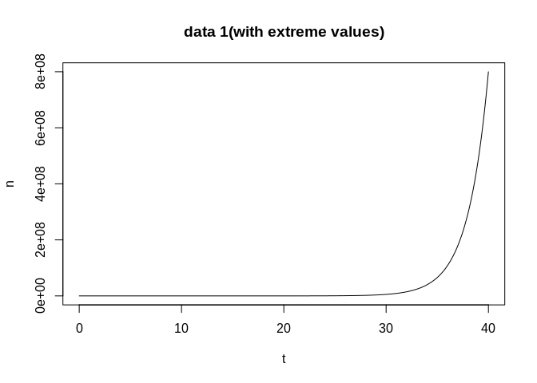
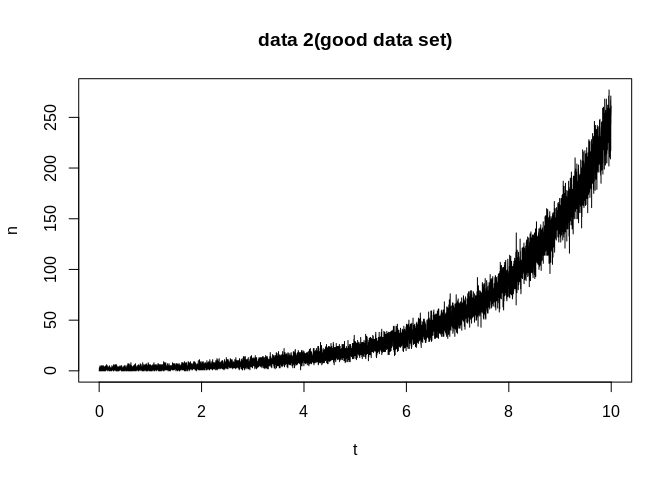

-   [Question 1](#question-1)
    -   [Likelihood function:](#likelihood-function)
    -   [Program - R](#program---r)
        -   [Function lik\_score\_info,
            mle\_nr](#function-lik_score_info-mle_nr)
        -   [Generate data and test function
            mle\_nr](#generate-data-and-test-function-mle_nr)
        -   [Estimated covariance matrix](#estimated-covariance-matrix)
        -   [R built-in function nlm to find
            MLE](#r-built-in-function-nlm-to-find-mle)
        -   [Comments](#comments)
-   [Question 2](#question-2)
    -   [Function EM.truncnorm](#function-em.truncnorm)
    -   [Generate 5 data sets and test function
        EM.truncnorm](#generate-5-data-sets-and-test-function-em.truncnorm)
    -   [R built-in function nlm to find
        MLE](#r-built-in-function-nlm-to-find-mle-1)
    -   [Comments](#comments-1)

Question 1
==========

### Likelihood function:

$$
L(a,b)=\\prod\_{i=1}^{m} \\frac{\\lambda(t\_i)^{n\_i} \\exp(-\\lambda(t\_i)) }{n\_i!}
$$

\#\#\#n data points:
(*t*<sub>1</sub>, *n*<sub>1</sub>), (*t*<sub>2</sub>, *n*<sub>2</sub>), ..., (*t*<sub>*m*</sub>, *n*<sub>*m*</sub>)

\#\#\#Negative log-likelihood function of *a* and *b*:
$$-l(a,b)=-\\log(L(a,b))=-\\sum\_{i=1}^{m} \[ n\_i(a+bt\_i)-e^{a+bt\_i} -\\log n\_i!\]$$

\#\#\#Negative score function:
$$-\\frac{\\partial l(a,b)}{\\partial a}=-\\sum\_{i=1}^{m}\[n\_i-e^{a+bt\_i}\] $$
$$-\\frac{\\partial l(a,b)}{\\partial b}=-\\sum\_{i=1}^{m}\[(n\_i-e^{a+bt\_i})t\_i\]$$

\#\#\#Information function:
$$-\\frac{\\partial^2 l(a,b)}{\\partial a^2}=\\sum\_{i=1}^{m} \[e^{a+bt\_i}\] $$
$$-\\frac{\\partial^2 l(a,b)}{\\partial a\\partial b}=\\sum\_{i=1}^{m} \[e^{a+bt\_i}t\_i\] $$

$$-\\frac{\\partial^2 l(a,b)}{\\partial b^2}=\\sum\_{i=1}^{m} \[e^{a+bt\_i} t\_i^2\] $$

\#\#\#Hessian matrix:
$$\\triangledown^2-l(a,b)=\\sum\_{i=1}^{m}  
\\begin{pmatrix} 
1 & t\_i \\\\
t\_i & t\_i^2 
\\end{pmatrix}
e^{a+bt\_i}$$

From the above expression, we see ▿<sup>2</sup> − *l*(*a*, *b*) is
positive definite unless *t*<sub>1</sub> = ... = *t*<sub>*m*</sub>.
Thus, this is a well-behaved problem.

Program - R
-----------

### Function lik\_score\_info, mle\_nr

``` r
# function to compute -log likelihood, -score and information.
# b=parameters, t=times, n=the number of decays
lik_score_info <- function(b,t,n) {
  lambda <- exp(b[1]+b[2]*t)
  l <- -sum((b[1]+b[2]*t)*n-lambda) #-log(factorial(n))
  s <- -c(sum(n-lambda),sum(t*(n-lambda)))
  v <- matrix(c(sum(lambda),sum(lambda*t),0,sum(lambda*t*t)),2,2)
  v[1,2] <- v[2,1]
  list(neg.loglik=l,neg.score=s,inf=v)
}

# finding MLE with newton-raphson method
mle_nr <- function(b0, no_iter, t, n, debug=FALSE)
{
  result_nr <- matrix(0,no_iter+1, 3)
  colnames(result_nr) <- c('a','b','neg_loglike')
  result_nr[1,] <- c(b0, 0)
  for( i in 1:no_iter + 1)
  {
    q <- lik_score_info(result_nr[i-1,1:2],t,n)
    result_nr[i,1:2] <- result_nr[i-1,1:2] - solve(q$inf,q$neg.score)
    result_nr[i-1,3] <- q$neg.loglik
    if(debug) print(result_nr[i-1,])
  }
  result_nr[-(no_iter+1),]
}
```

### Generate data and test function mle\_nr

``` r
# generate a data set
# b=parameters; m=the number of data points
# gen_data1 generating data with very big values for n
# converge to something other than global maximum
gen_data1 <- function(b,m)
{
  t <- sort(runif(m,0,40))  
  lambda <- exp(b[1]+b[2]*t)
  n <- rpois(m,lambda)
  plot (t, n, type = "l", main = "data 1(with extreme values)")
  list(t=t,n=n)
}

# take a=0.5, b=0.5 for example
data1 <- gen_data1(c(0.5,0.5),10000)
```



``` r
# using self-programmed newton method using data1
# converge to something other than global maximum
mle1 <- mle_nr( c(1,1), 15, data1$t, data1$n)
mle1 
```

    ##                   a         b  neg_loglike
    ##  [1,]  1.000000e+00 1.0000000 1.636510e+20
    ##  [2,]  9.905407e-08 1.0000000 6.020382e+19
    ##  [3,] -9.999996e-01 1.0000000 2.214774e+19
    ##  [4,] -1.999999e+00 1.0000000 8.147689e+18
    ##  [5,] -2.999997e+00 0.9999999 2.997358e+18
    ##  [6,] -3.999992e+00 0.9999998 1.102658e+18
    ##  [7,] -4.999977e+00 0.9999994 4.056368e+17
    ##  [8,] -5.999937e+00 0.9999984 1.492174e+17
    ##  [9,] -6.999828e+00 0.9999957 5.488621e+16
    ## [10,] -7.999533e+00 0.9999883 2.018397e+16
    ## [11,] -8.998730e+00 0.9999683 7.417987e+15
    ## [12,] -9.996549e+00 0.9999137 2.721907e+15
    ## [13,] -1.099062e+01 0.9997655 9.945772e+14
    ## [14,] -1.197451e+01 0.9993627 3.593894e+14
    ## [15,] -1.293080e+01 0.9982697 1.259777e+14

``` r
# gen_data2 generating data with reasonable values for n
# converge to global maximum
gen_data2 <- function(b,m)
{
  t <- sort(runif(m,0,10))  
  lambda <- exp(b[1]+b[2]*t)
  n <- rpois(m,lambda)
  plot (t, n, type = "l", main = "data 2(good data set)")
  list(t=t,n=n)
}

data2 <- gen_data2(c(0.5,0.5),10000)
```



``` r
# using self-programmed newton method using data2
# converge to global maximum
mle2 <- mle_nr( c(1,1), 15, data2$t, data2$n)
mle2 
```

    ##                a         b neg_loglike
    ##  [1,]  1.0000000 1.0000000  55658419.8
    ##  [2,]  0.0774392 0.9923058  18354282.4
    ##  [3,] -0.7182846 0.9720445   4922068.4
    ##  [4,] -1.2061020 0.9214942    249535.1
    ##  [5,] -1.0813938 0.8121708  -1247247.2
    ##  [6,] -0.2842380 0.6469163  -1645195.0
    ##  [7,]  0.3609033 0.5294688  -1710358.1
    ##  [8,]  0.4959456 0.5014194  -1713502.6
    ##  [9,]  0.5032918 0.4997707  -1713513.6
    ## [10,]  0.5033185 0.4997646  -1713513.6
    ## [11,]  0.5033185 0.4997646  -1713513.6
    ## [12,]  0.5033185 0.4997646  -1713513.6
    ## [13,]  0.5033185 0.4997646  -1713513.6
    ## [14,]  0.5033185 0.4997646  -1713513.6
    ## [15,]  0.5033185 0.4997646  -1713513.6

### Estimated covariance matrix

``` r
obs.inf <- lik_score_info(mle2[15,1:2], data2$t, data2$n)$inf
cov.matrix <- solve(obs.inf); cov.matrix
```

    ##               [,1]          [,2]
    ## [1,]  4.209109e-05 -4.952615e-06
    ## [2,] -4.952615e-06  6.128432e-07

``` r
## standard errors for a and b
se <- sqrt(diag(cov.matrix)); se
```

    ## [1] 0.0064877646 0.0007828431

### R built-in function nlm to find MLE

``` r
# use R built-in function nlm to find MLE
# drop constant 
neg_loglike <- function(b,t,n)
{
  lambda <- exp(b[1]+b[2]*t)
  -sum((b[1]+b[2]*t)*n-lambda)
}

# using data1, good initial values converges to global maximum 
nlm (neg_loglike, c(0.45, 0.55) , t = data1$t, n = data1$n, hessian = T)
```

    ## $minimum
    ## [1] -7.65394e+12
    ## 
    ## $estimate
    ## [1] 0.4487367 0.5013455
    ## 
    ## $gradient
    ## [1] -57495840   1793730
    ## 
    ## $hessian
    ##              [,1]         [,2]
    ## [1,] 4.137779e+11 1.575242e+13
    ## [2,] 1.575242e+13 6.012942e+14
    ## 
    ## $code
    ## [1] 2
    ## 
    ## $iterations
    ## [1] 9

``` r
# using data1, bad initial values causing problem
nlm (neg_loglike, c(1, 1) , t = data1$t, n = data1$n, hessian = T)
```

    ## $minimum
    ## [1] 2.034812e+15
    ## 
    ## $estimate
    ## [1]   -2.345113 -129.365415
    ## 
    ## $gradient
    ## [1] -4.137940e+11 -1.572168e+13
    ## 
    ## $hessian
    ##          [,1] [,2]
    ## [1,] -2.5e+07    0
    ## [2,]  0.0e+00    0
    ## 
    ## $code
    ## [1] 2
    ## 
    ## $iterations
    ## [1] 2

``` r
# using data2, good initial values converges to global maximum
nlm (neg_loglike, c(0.2, 0.8) , t = data2$t, n = data2$n, hessian = T) -> mle_nlm; mle_nlm
```

    ## $minimum
    ## [1] -1713514
    ## 
    ## $estimate
    ## [1] 0.5033906 0.4997556
    ## 
    ## $gradient
    ## [1] -0.007683411 -0.057742000
    ## 
    ## $hessian
    ##           [,1]     [,2]
    ## [1,]  483804.1  3911253
    ## [2,] 3911253.5 33253997
    ## 
    ## $code
    ## [1] 1
    ## 
    ## $iterations
    ## [1] 21

``` r
# using data2, bad initial values causing problem
nlm (neg_loglike, c(1, 2) , t = data2$t, n = data2$n, hessian = T)
```

    ## $minimum
    ## [1] 1853137626
    ## 
    ## $estimate
    ## [1]  -48.44392 -468.02491
    ## 
    ## $gradient
    ## [1]  -483756 -3909413
    ## 
    ## $hessian
    ##      [,1] [,2]
    ## [1,]    0    0
    ## [2,]    0    0
    ## 
    ## $code
    ## [1] 2
    ## 
    ## $iterations
    ## [1] 2

``` r
# find MLE standard errors using hessian of negative log likelihood from nlm
se.nlm <- sqrt (diag (solve(mle_nlm$hessian)))
# compare MLE and standard errors based on N-R function and built in function nlm
# se.nlm and se(based on observed information)
compare1 <- data.frame(rbind(mle2[15,1:2],mle_nlm$estimate,se,se.nlm),
                row.names = c("mle_nr","mle_nlm","se_nr","se_nlm"))
colnames(compare1) <- c("a","b")
compare1
```

<script data-pagedtable-source type="application/json">
{"columns":[{"label":[""],"name":["_rn_"],"type":[""],"align":["left"]},{"label":["a"],"name":[1],"type":["dbl"],"align":["right"]},{"label":["b"],"name":[2],"type":["dbl"],"align":["right"]}],"data":[{"1":"0.503318548","2":"0.4997646132","_rn_":"mle_nr"},{"1":"0.503390598","2":"0.4997556338","_rn_":"mle_nlm"},{"1":"0.006487765","2":"0.0007828431","_rn_":"se_nr"},{"1":"0.006485837","2":"0.0007823100","_rn_":"se_nlm"}],"options":{"columns":{"min":{},"max":[10]},"rows":{"min":[10],"max":[10]},"pages":{}}}
  </script>

### Comments

For question 1, there are problems with Newton-Raphson iterations
failing to converge or converging to something other than the global
maximum. From the above examples, different data sets lead to different
results. It might be worth trying set boundaries when generating the
data, to avoid extreme values for lambda. So Newton-Raphson method has
problems and limitations for this question. For R built-in function nlm,
it works better if we are able to find the good initial values; but it
also has convergence problem if we do not have good initial values.

Question 2
==========

### Function EM.truncnorm

``` r
library(truncnorm)
loglike <- function(mu,sigma,y)
{
  sum(log(pnorm((y+1-mu)/sigma) - pnorm((y-mu)/sigma)))
}
# The function below finds the maximum likelihood estimate for mu, sigma given
# the data, using the EM algorithm started from the specified guess at mu0 and 
# sigma (default being the mean and standard deviation of y), run for the
# specified number of iterations (default 15).  The log likelihood is printed 
# at each iteration.  It should never decrease.
# Z is missed data
# y is observed integer part of Z
# m is the number of sample size from truncnorm
EM.truncnorm <- function (m, y, mu0=mean(y), sigma0=sqrt(var(y)), iterations=15)
{
  # Set initial guess, and print it and its log likelihood.
  n <- length(y)
  mu <- mu0
  sigma <- sigma0
  cat (0, mu, sigma, loglike(mu,sigma,y), "\n")
  
  # Do EM iterations.
  for (i in 1:iterations)
  {
    # The E step: For this model, draw samples from a truncated normal distribution 
    # to approximate the expectation of Z and Z^2, denoted by EZ and EZ2 respectively
    EZ <- rep(0,n) 
    for (j in 1:n) {
      EZ[j] <- mean(rtruncnorm(m, a=y[j], b=y[j]+1, mean = mu, sd = sigma))
      sum.EZ <- sum(EZ)
    }
    
    EZ2 <- rep(0,n) 
    for (j in 1:n) {
      EZ2[j] <- mean(rtruncnorm(m, a=y[j], b=y[j]+1, mean = mu, sd = sigma)^2)
      sum.EZ2 <- sum(EZ2)
    }
    
    # The M step: Find the mu and sigma that maximizes the log likelihood
    # with unobserved data filled in according to the distribution found in
    # the E step.
    mu <- sum.EZ/n
    sigma <- sqrt((sum.EZ2 - 2*mu*sum.EZ + n*mu^2)/(n)) 
    
    # Print the new guess and its log likelihood.
    cat (i, mu, sigma, loglike(mu,sigma,y), "\n")
  }
  
  # Return the values for mu and sigma from the final EM iteration.
  list(mu=mu, sigma=sigma)
}
```

### Generate 5 data sets and test function EM.truncnorm

``` r
#data set 1
Z1 <- rnorm(100,0,2)
y1 <- floor(Z1)
EM1 <- EM.truncnorm(m=100, y1);EM1
```

    ## 0 -0.72 2.108568 -218.772 
    ## 1 -0.2225644 2.076694 -215.9927 
    ## 2 -0.2189428 2.077923 -215.9926 
    ## 3 -0.2191944 2.080421 -215.9927 
    ## 4 -0.2188835 2.079368 -215.9926 
    ## 5 -0.2175926 2.079075 -215.9926 
    ## 6 -0.2209678 2.079794 -215.9926 
    ## 7 -0.2232675 2.079428 -215.9927 
    ## 8 -0.2240069 2.080779 -215.9929 
    ## 9 -0.2231988 2.076543 -215.9927 
    ## 10 -0.2184444 2.077716 -215.9926 
    ## 11 -0.2223681 2.073719 -215.993 
    ## 12 -0.2272304 2.075451 -215.9933 
    ## 13 -0.221756 2.079504 -215.9926 
    ## 14 -0.2179876 2.081391 -215.9928 
    ## 15 -0.2256188 2.0776 -215.9929

    ## $mu
    ## [1] -0.2256188
    ## 
    ## $sigma
    ## [1] 2.0776

``` r
#data set 2
Z2 <- rnorm(100,0,2)
y2 <- floor(Z2)
EM2 <- EM.truncnorm(m=1000, y2);EM2
```

    ## 0 -0.42 1.902577 -209.1135 
    ## 1 0.06936185 1.871498 -205.7125 
    ## 2 0.07890422 1.870703 -205.7109 
    ## 3 0.07889433 1.871671 -205.7109 
    ## 4 0.07974953 1.869996 -205.7109 
    ## 5 0.07919458 1.870397 -205.7109 
    ## 6 0.07910569 1.869894 -205.7109 
    ## 7 0.08081866 1.872656 -205.711 
    ## 8 0.07896228 1.869169 -205.7109 
    ## 9 0.08236185 1.871942 -205.711 
    ## 10 0.0793029 1.869857 -205.7109 
    ## 11 0.08063894 1.872026 -205.7109 
    ## 12 0.0808212 1.870615 -205.7109 
    ## 13 0.0813277 1.87165 -205.7109 
    ## 14 0.08184882 1.873379 -205.7111 
    ## 15 0.08080216 1.870983 -205.7109

    ## $mu
    ## [1] 0.08080216
    ## 
    ## $sigma
    ## [1] 1.870983

``` r
#data set 3
Z3 <- rnorm(1000,0,2)
y3 <- floor(Z3)
EM3 <- EM.truncnorm(m=100, y3);EM3
```

    ## 0 -0.448 1.880647 -2084.726 
    ## 1 0.03932849 1.858435 -2050.075 
    ## 2 0.0514292 1.857659 -2050.052 
    ## 3 0.05260246 1.858243 -2050.052 
    ## 4 0.05107305 1.858758 -2050.053 
    ## 5 0.05351508 1.858865 -2050.053 
    ## 6 0.05181371 1.856231 -2050.053 
    ## 7 0.05277761 1.856843 -2050.052 
    ## 8 0.05257505 1.857916 -2050.052 
    ## 9 0.05253903 1.857854 -2050.052 
    ## 10 0.0527165 1.857342 -2050.052 
    ## 11 0.05197826 1.856873 -2050.052 
    ## 12 0.05176835 1.857393 -2050.052 
    ## 13 0.05145835 1.856118 -2050.053 
    ## 14 0.05089946 1.857396 -2050.052 
    ## 15 0.05243747 1.857418 -2050.052

    ## $mu
    ## [1] 0.05243747
    ## 
    ## $sigma
    ## [1] 1.857418

``` r
#data set 4
Z4 <- rnorm(5000,6,4)
y4 <- floor(Z4)
EM4 <- EM.truncnorm(m=1000, y4);EM4
```

    ## 0 5.4138 3.949543 -14002.09 
    ## 1 5.911126 3.938911 -13962.19 
    ## 2 5.914005 3.938139 -13962.19 
    ## 3 5.913805 3.938784 -13962.19 
    ## 4 5.913657 3.938841 -13962.19 
    ## 5 5.913812 3.938533 -13962.19 
    ## 6 5.913835 3.938524 -13962.19 
    ## 7 5.913651 3.939341 -13962.19 
    ## 8 5.913833 3.938787 -13962.19 
    ## 9 5.914029 3.93836 -13962.19 
    ## 10 5.913771 3.938673 -13962.19 
    ## 11 5.913697 3.939389 -13962.19 
    ## 12 5.913789 3.938998 -13962.19 
    ## 13 5.91403 3.938106 -13962.19 
    ## 14 5.913652 3.938674 -13962.19 
    ## 15 5.913794 3.938552 -13962.19

    ## $mu
    ## [1] 5.913794
    ## 
    ## $sigma
    ## [1] 3.938552

``` r
#data set 5
Z5 <- rnorm(10000,-5,5)
y5 <- floor(Z5)
EM5 <- EM.truncnorm(m=1000, y5);EM5
```

    ## 0 -5.4318 5.039989 -30412 
    ## 1 -4.933307 5.031335 -30362.92 
    ## 2 -4.931484 5.031632 -30362.92 
    ## 3 -4.931635 5.031619 -30362.92 
    ## 4 -4.931638 5.031783 -30362.92 
    ## 5 -4.931903 5.031386 -30362.92 
    ## 6 -4.931757 5.031332 -30362.92 
    ## 7 -4.931931 5.031095 -30362.92 
    ## 8 -4.931826 5.031568 -30362.92 
    ## 9 -4.931834 5.031365 -30362.92 
    ## 10 -4.93184 5.031581 -30362.92 
    ## 11 -4.931601 5.031649 -30362.92 
    ## 12 -4.931971 5.03136 -30362.92 
    ## 13 -4.931698 5.03163 -30362.92 
    ## 14 -4.931748 5.031401 -30362.92 
    ## 15 -4.931609 5.031639 -30362.92

    ## $mu
    ## [1] -4.931609
    ## 
    ## $sigma
    ## [1] 5.031639

### R built-in function nlm to find MLE

``` r
##use R built-in function nlm to find MLE
neg_loglike <- function(b,y)
{
  -sum(log(pnorm((y+1-b[1])/b[2]) - pnorm((y-b[1])/b[2])))
}

EM_nlm1 <- nlm (neg_loglike, c(mean(y1), sqrt(var(y1))) , y1, hessian = T)
EM_nlm2 <- nlm (neg_loglike, c(mean(y2), sqrt(var(y2))) , y2, hessian = T)
EM_nlm3 <- nlm (neg_loglike, c(mean(y3), sqrt(var(y3))) , y3, hessian = T)
EM_nlm4 <- nlm (neg_loglike, c(mean(y4), sqrt(var(y4))) , y4, hessian = T)
EM_nlm5 <- nlm (neg_loglike, c(mean(y5), sqrt(var(y5))) , y5, hessian = T)

# compare estimates based on function EM.truncnorm and built-in function nlm
r1 <- c(0,2,unlist(EM1),EM_nlm1$estimate); r2 <- c(0,2,unlist(EM2),EM_nlm2$estimate)
r3 <- c(0,2,unlist(EM3),EM_nlm3$estimate); r4 <- c(6,4,unlist(EM4),EM_nlm4$estimate)
r5 <- c(-5,5,unlist(EM5),EM_nlm5$estimate)
compare2 <- data.frame(rbind(r1,r2,r3,r4,r5),
                row.names = c("data1","data2","data3","data4","data5"))
colnames(compare2) <- c("mu_true","sigma_true","mu_EM","sigma_EM","mu_nlm","sigma_nlm")
format(compare2, digits=5) 
```

<script data-pagedtable-source type="application/json">
{"columns":[{"label":[""],"name":["_rn_"],"type":[""],"align":["left"]},{"label":["mu_true"],"name":[1],"type":["S3: AsIs"],"align":["right"]},{"label":["sigma_true"],"name":[2],"type":["S3: AsIs"],"align":["right"]},{"label":["mu_EM"],"name":[3],"type":["S3: AsIs"],"align":["right"]},{"label":["sigma_EM"],"name":[4],"type":["S3: AsIs"],"align":["right"]},{"label":["mu_nlm"],"name":[5],"type":["S3: AsIs"],"align":["right"]},{"label":["sigma_nlm"],"name":[6],"type":["S3: AsIs"],"align":["right"]}],"data":[{"1":"0","2":"2","3":"-0.225619","4":"2.0776","5":"-0.220052","6":"2.0781","_rn_":"data1"},{"1":"0","2":"2","3":"0.080802","4":"1.8710","5":"0.080025","6":"1.8708","_rn_":"data2"},{"1":"0","2":"2","3":"0.052437","4":"1.8574","5":"0.051992","6":"1.8574","_rn_":"data3"},{"1":"6","2":"4","3":"5.913794","4":"3.9386","5":"5.913796","6":"3.9386","_rn_":"data4"},{"1":"-5","2":"5","3":"-4.931609","4":"5.0316","5":"-4.931803","6":"5.0315","_rn_":"data5"}],"options":{"columns":{"min":{},"max":[10]},"rows":{"min":[10],"max":[10]},"pages":{}}}
  </script>

### Comments

For the above data sets, function EM.truncnorm and built-in function nlm
got the similar estimates close to the true parameters, which means both
approaches are effective. The sample size for observed data y is denoted
by n, and m is the sample size drawing from truncnorm when approximate
the expectations. Data set 1,2,3 are drawed from the same parameters,
but different values of n/m.

For data 1, n=100, m=100; data 2, n=100, m=1000; data 3, n=1000, m=100;
data 4, n=5000, m=1000; data 5, n=10000, m=1000. It can be clearly seen
that as sample size n/m increases, the estimates become more accurate.
