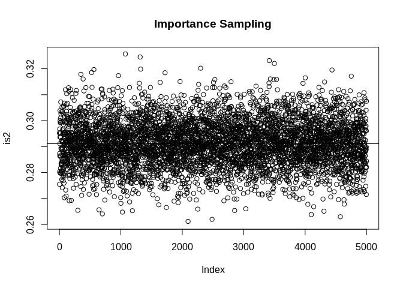

-   [Method (1)](#method-1)
-   [Method (2)](#method-2)
-   [Method (3)](#method-3)
    -   [*l*(*x*) and *f̃*(*x*)](#lx-and-tildefx)
    -   [PDF of g(x)](#pdf-of-gx)
    -   [CDF of g(x)](#cdf-of-gx)
    -   [The inverse of G(x)](#the-inverse-of-gx)
-   [Method (4)](#method-4)
    -   [Tangent line of *l**o**g*(*ϕ*(*x*)) at
        $\\frac{l+u}{2}$](#tangent-line-of-logphix-at-fraclu2)
    -   [PDF of g(x)](#pdf-of-gx-1)
    -   [CDF of g(x)](#cdf-of-gx-1)
    -   [The inverse of G(x)](#the-inverse-of-gx-1)
-   [Question (a)](#question-a)
-   [Question (b)](#question-b)
    -   [Test 1 (Use A1, l=1, u=2)](#test-1-use-a1-l1-u2)
    -   [Test 2 (Use A2, l=-1, u=1)](#test-2-use-a2-l-1-u1)
    -   [Test 3 (Use A3, l=-1, u=0)](#test-3-use-a3-l-1-u0)
    -   [Test other intervals (l=-5,
        u=-3)](#test-other-intervals-l-5-u-3)
    -   [Comments](#comments)

Method (1)
----------

``` r
## midpoint rule
## a function computing the sum of numbers represented with logarithm
## lx     --- a vector of numbers, which are the log of another vector x.
## the log of sum of x is returned
log_sum_exp <- function(lx)
{   mlx <- max(lx)
mlx + log(sum(exp(lx-mlx)))
}

## the generic function for approximating 1-D integral with midpoint rule
## the logarithms of the function values are passed in
## the log of the integral result is returned
## log_f  --- a function computing the logarithm of the integrant function
## range  --- the range of integral varaible, a vector of two elements
## n      --- the number of points at which the integrant is evaluated
## ...    --- other parameters needed by log_f
log_int_mid <- function(log_f, range, n,...)
{   if(range[1] >= range[2]) 
  stop("Wrong ranges")
  h <- (range[2]-range[1]) / n
  v_log_f <- sapply(range[1] + (1:n - 0.5) * h, log_f,...)
  log_sum_exp(v_log_f) + log(h)       
}

#Find the true value of E[a(x)] by midpoint rule
a_tnorm_mid <- function(fa,l,u,n)
{
  log_f <- function(x)  log(fa(x))+dnorm(x,log = TRUE)
  log_integral<-log_int_mid(log_f=log_f, range=c(l,u), n=n)
  exp(log_integral)/(pnorm(u)-pnorm(l))
}
```

Method (2)
----------

``` r
library(truncnorm)
#1 Draw samples from a truncated normal distribution
a_tnorm_naive1 <- function(fa,l,u,n)
{
  x<-rtruncnorm(n, a=l, b=u, mean = 0, sd = 1)
  mean(fa(x))  
}

#2 Draw samples from N(0,1), and keep samples within interval(l,u)
a_tnorm_naive <- function(fa,l,u,n)
{
  x <- rep (0, n)
  for (i in 1:n)
  {
    rej <- TRUE
    while (rej)
    {
      x[i] <- rnorm (1)
      if (x[i] >= l & x[i] <= u) rej <- FALSE
    }
  }
  mean(fa(x))  
}
```

Method (3)
----------

### *l*(*x*) and *f̃*(*x*)

$$(l,\\ \\log(l)), \\ (u, \\ \\log(u)), \\ \\ \\ \\ \\ \\ \\ let\\ \\ m=\\frac{l+u}{2} $$

$$l(x)=-\\frac{1}{2}(l+u)x+\\frac{ul}{2}-\\frac{log(2\\pi)}{2}=-mx+\\frac{ul}{2}-\\frac{log(2\\pi)}{2}$$

$$\\tilde{f}(x)=\\exp(-mx+\\frac{ul}{2}-\\frac{log(2\\pi)}{2}), \\ \\ \\ x \\in(l,u)$$

### PDF of g(x)

$$g(x)=a\\tilde{f}(x), \\ a=\\frac{1}{\\int\_{l}^{u}\\tilde{f}(x)}=\\frac{m}{c(e^{-ml}-e^{-mu})}, \\ \\ c=\\exp(\\frac{ul}{2}-\\frac{log(2\\pi)}{2})$$

### CDF of g(x)

$$G(x)=\\frac{e^{-ml}-e^{-mx}}{e^{-ml}-e^{-mu}},\\ \\ \\ x \\in(l,u)$$

### The inverse of G(x)

$$m\\neq0, \\ \\ \\ G^{-1}(v) = -\\frac{1}{m}\\log(e^{-ml}(1-v)+e^{-mu}v), \\ \\ \\ \\ \\ \\ x \\in(l,u)$$
 *g*(*x*) follows a uniform distribution unif(l,u) when *m* = 0

``` r
## Importance sampling
a_tnorm_is <- function(fa, l, u, n)
{
  x <- rep(0,n) 
  m <- (l+u)/2
  v <- runif(n)
  if (m!=0){
    x <- -1/m*log(exp(-m*l)*(1-v)+v*exp(-m*u)) #m cannot be zero
  } else {
    x <- runif(n,l,u)#when m=0, l=-u, gx~unif(l,u)
  }
  fx <- dnorm(x)/(pnorm(u)-pnorm(l))
  gx <- exp(-m*x+0.5*u*l-0.5*log(2*pi))
  W <- fx/gx
  ahat <- sum (fa(x) * W) / sum (W)
  attr(ahat, "effective sample size") <- 1/sum((W/sum(W))^2)
  ahat
}
```

Method (4)
----------

### Tangent line of *l**o**g*(*ϕ*(*x*)) at $\\frac{l+u}{2}$

let $m=\\frac{l+u}{2}$,
$$\\log \\phi(x)=-\\frac{1}{2}\\log(2\\pi)-\\frac{x^2}{2}$$
\[log *ϕ*(*x*)\]′ =  − *x*
$$\\log l(x)=-m(x-m)-\\frac{1}{2}\\log(2\\pi)-\\frac{m^2}{2}=-mx+\\frac{m^2}{2}-\\frac{1}{2}\\log(2\\pi)$$

### PDF of g(x)

$$l(x)=\\exp(-mx+\\frac{m^2}{2}-\\frac{1}{2}\\log(2\\pi))$$
*g*(*x*)=
$$g(x)=al(x), \\ a=\\frac{1}{\\int\_{l}^{u}l(x)}=\\frac{m}{c(e^{-ml}-e^{-mu})}, \\ \\ c=\\exp(\\frac{m^2}{2}-\\frac{log(2\\pi)}{2})$$

### CDF of g(x)

$$G(x)=\\frac{e^{-ml}-e^{-mx}}{e^{-ml}-e^{-mu}},\\ \\ \\ x \\in(l,u)$$

### The inverse of G(x)

$$m\\neq0, \\ \\ \\ G^{-1}(v) = -\\frac{1}{m}\\log(e^{-ml}(1-v)+e^{-mu}v), \\ \\ \\ \\ \\ \\ x \\in(l,u)$$
 *g*(*x*) follows a uniform distribution unif(l,u) when *m* = 0

``` r
## log(g(x))
log_g <- function(x, l, u)
{
  m <- (l+u)/2
  -m*x+0.5*m^2-0.5*log(2*pi)
}

## Rejection sampling
a_tnorm_rej <- function(fa, l, u, n)
{
  sample<-rep(0,n)
  for (i in 1:n) {
    rejected <- TRUE
    while (rejected) {
      v <- runif(1)
      m <- (l+u)/2
      if (m!=0){
        sample[i] <- -1/m*log(exp(-m*l)*(1-v)+v*exp(-m*u)) #m cannot be zero
      } else {
        sample[i] <- runif(1,l,u)#when m=0, l=-u, gx is a uniform dist
      }
      U <- runif(1)
      rejected <- (log(U) > dnorm(sample[i],log = TRUE) - log_g(sample[i],l,u) )
    }
  }
  mean(fa(sample))
}
```

Question (a)
============

``` r
## a(x)=x^2
fa <- function(x) x^2
## true value of E[a(X)]
A1 <- a_tnorm_mid (fa,1,2,1000000)
A2 <- a_tnorm_mid (fa,-1,1,1000000)
A3 <- a_tnorm_mid (fa,-1,0,1000000)
```

Question (b)
============

### Test 1 (Use A1, l=1, u=2)

``` r
system.time(
a_tnorm_naive(fa,1,2,1000) ## naive
)
```

    ##    user  system elapsed 
    ##   0.015   0.001   0.015

``` r
system.time(
a_tnorm_is(fa, 1, 2, 1000) ## importance sampling
)
```

    ##    user  system elapsed 
    ##   0.012   0.000   0.012

``` r
system.time(
a_tnorm_rej(fa, l=1, u=2, 1000) ## rejection sampling
)
```

    ##    user  system elapsed 
    ##   0.017   0.000   0.017

``` r
## replicate 5000 times to find MSE
times.naive1 <- system.time(
naive1 <- replicate (5000, a_tnorm_naive(fa,1,2,1000)) 
)

times.is1 <- system.time(
is1 <- replicate (5000, a_tnorm_is(fa, 1, 2, 1000)) 
)

times.rej1 <- system.time(
rej1 <- replicate (5000, a_tnorm_rej(fa, 1, 2, 1000)) 
)

MSE.naive1 <- mean ((naive1-A1)^2)
MSE.is1 <- mean ((is1-A1)^2)
MSE.rej1 <- mean ((rej1-A1)^2)

MSE.naive1; times.naive1
```

    ## [1] 0.0006141862

    ##    user  system elapsed 
    ##  56.988   0.000  56.994

``` r
MSE.is1; times.is1
```

    ## [1] 0.0006139018

    ##    user  system elapsed 
    ##   0.455   0.000   0.455

``` r
MSE.rej1; times.rej1
```

    ## [1] 0.0006056646

    ##    user  system elapsed 
    ##  24.625   0.000  24.627

``` r
ylim <- range (naive1, is1, rej1)
plot (naive1, ylim = ylim, main = "Naive MC") 
abline (h = A1)
```


``` r
plot (is1, ylim = ylim, main = "Importance Sampling") 
abline (h = A1)
```


``` r
plot (rej1, ylim = ylim, main = "Rejection Sampling") 
abline (h = A1)
```


### Test 2 (Use A2, l=-1, u=1)

``` r
## replicate 5000 times to find MSE
times.naive2 <- system.time(
naive2 <- replicate (5000, a_tnorm_naive(fa,-1,1,1000)) 
)

times.is2 <- system.time(
is2 <- replicate (5000, a_tnorm_is(fa, -1, 1, 1000)) 
)

times.rej2 <- system.time(
rej2 <- replicate (5000, a_tnorm_rej(fa, -1, 1, 1000)) 
)

MSE.naive2 <- mean ((naive2-A2)^2)
MSE.is2 <- mean ((is2-A2)^2)
MSE.rej2 <- mean ((rej2-A2)^2)

MSE.naive2; times.naive2
```

    ## [1] 8.064897e-05

    ##    user  system elapsed 
    ##  11.616   0.000  11.616

``` r
MSE.is2; times.is2
```

    ## [1] 7.555142e-05

    ##    user  system elapsed 
    ##   0.459   0.000   0.460

``` r
MSE.rej2; times.rej2
```

    ## [1] 7.628642e-05

    ##    user  system elapsed 
    ##  34.898   0.000  34.903

``` r
ylim <- range (naive2, is2, rej2)
plot (naive2, ylim = ylim, main = "Naive MC") 
abline (h = A2)
```


``` r
plot (is2, ylim = ylim, main = "Importance Sampling") 
abline (h = A2)
```



``` r
plot (rej2, ylim = ylim, main = "Rejection Sampling") 
abline (h = A2)
```


### Test 3 (Use A3, l=-1, u=0)

``` r
## replicate 5000 times to find MSE
times.naive3 <- system.time(
naive3 <- replicate (5000, a_tnorm_naive(fa,-1,0,1000)) 
)

times.is3 <- system.time(
is3 <- replicate (5000, a_tnorm_is(fa, -1, 0, 1000)) 
)

times.rej3 <- system.time(
rej3 <- replicate (5000, a_tnorm_rej(fa, -1, 0, 1000)) 
)

MSE.naive3 <- mean ((naive3-A3)^2)
MSE.is3 <- mean ((is3-A3)^2)
MSE.rej3 <- mean ((rej3-A3)^2)

MSE.naive3; times.naive3
```

    ## [1] 7.859274e-05

    ##    user  system elapsed 
    ##  23.168   0.000  23.170

``` r
MSE.is3; times.is3
```

    ## [1] 7.973142e-05

    ##    user  system elapsed 
    ##   0.448   0.000   0.447

``` r
MSE.rej3; times.rej3
```

    ## [1] 8.134141e-05

    ##    user  system elapsed 
    ##  24.445   0.000  24.447

``` r
ylim <- range (naive3, is3, rej3)
plot (naive3, ylim = ylim, main = "Naive MC") 
abline (h = A3)
```


``` r
plot (is3, ylim = ylim, main = "Importance Sampling") 
abline (h = A3)
```


``` r
plot (rej3, ylim = ylim, main = "Rejection Sampling") 
abline (h = A3)
```


### Test other intervals (l=-5, u=-3)

``` r
a_tnorm_mid (fa,-5,-3,1000000)
```

    ## [1] 10.84588

``` r
a_tnorm_naive(fa,-5,-3,1000)
```

    ## [1] 10.81784

``` r
a_tnorm_is(fa,-5,-3,1000)
```

    ## [1] 10.78826
    ## attr(,"effective sample size")
    ## [1] 979.4724

``` r
a_tnorm_rej(fa,-5,-3,1000)
```

    ## [1] 10.87522

Comments
--------

Above all, methods 2-4 all work well for estimating the E\[a(x)\], all
of them got very close estimations to the true values calculated by the
midpoint rule method. For three different sets of intervals from test1
to test3, Method (4) (Rejection sampling) is the most time consuming
one; Method (3) (Importance sampling) is the most efficiency method
among these three, which has the fastest speed. Also difference values
of l and u would lead to difference speed for 3 methods.
