-   [Question 1](#question-1)
    -   [Joint distribution](#joint-distribution)
    -   [Conditional distribution of
        *μ*](#conditional-distribution-of-mu)
    -   [Conditional distribution of
        *σ*<sup>2</sup>](#conditional-distribution-of-sigma2)
    -   [Conditional distribution of v](#conditional-distribution-of-v)
    -   [R function - Gibbs sampling](#r-function---gibbs-sampling)
    -   [Test 1 (*ν* = 2, *μ* =  − 3, *σ*<sup>2</sup> = 1) with
        different number of
        n](#test-1-nu2mu-3sigma21-with-different-number-of-n)
    -   [Test 2 (*ν* = 2, *μ* = 5, *σ*<sup>2</sup> = 2) with different
        number of n](#test-2-nu2mu5sigma22-with-different-number-of-n)
    -   [Compare with MLE found by nlm](#compare-with-mle-found-by-nlm)
-   [Question 2](#question-2)
    -   [rstan](#rstan)
    -   [JAGS](#jags)
    -   [Comments for both Q1 and Q2](#comments-for-both-q1-and-q2)

Question 1
==========

### Joint distribution

Joint distribution of *μ*, *σ*<sup>2</sup> and latent variances
*v*<sub>1</sub>, ..., *v*<sub>*n*</sub> given data
*y*<sub>1</sub>, ..., *y*<sub>*n*</sub> is proportional to
$$
(\\prod\_{i=1}^nP(y\_i\|\\mu,v\_i)P(v\_i\|\\sigma^2))P(\\mu)P(\\sigma^2)
$$

$$
=(\\prod\_{i=1}^n \\frac{1}{\\sqrt{ 2\\pi v\_i}}e^{-\\frac{(y\_i-\\mu)^2}{2v\_i}} \\times 
\\frac{1}{\\Gamma(\\frac{\\nu}{2})}v\_i^{-(\\nu/2+1)}(\\frac{\\nu \\sigma^2}{2})^{\\nu/2} e^{-\\frac{\\nu \\sigma^2}{2v\_i}}) \\times
\\frac{1}{\\sqrt{2\\pi100}}e^{-\\frac{\\mu^2}{200}} \\times
\\frac{1}{\\sigma^2}
$$

$$
\\propto (\\prod\_{i=1}^n v\_i)^{-\\frac{\\nu}{2}- \\frac{3}{2}} 
(\\sigma^2)^{\\frac{\\nu n}{2}-1}
e^{-\\sum\_{i=1}^{n}\\frac{(y\_i-\\mu)^2}{2v\_i}} 
e^{-\\sum\_{i=1}^n\\frac{\\nu \\sigma^2}{2v\_i}} 
e^{-\\frac{\\mu^2}{200}}
$$

### Conditional distribution of *μ*

$$
P(\\mu\|\\mathbf{v},\\mathbf{y},\\sigma^2) \\propto e^{-\\sum\_{i=1}^{n}\\frac{(y\_i-\\mu)^2}{2v\_i}} e^{-\\frac{\\mu^2}{200}} \\\\
\\propto \\exp(-\\frac{1}{2}\[(\\sum\_{i=1}^n \\frac{1}{v\_i}+\\frac{1}{100})\\mu^2-2\\mu \\sum\_{i=1}^n\\frac{y\_i}{v\_i}\])
$$

$$
\\frac{1}{\\sigma\_1^2}=(\\sum\_{i=1}^n \\frac{1}{v\_i}+\\frac{1}{100}) \\Rightarrow \\ \\sigma\_1^2=1/(\\sum\_{i=1}^n \\frac{1}{v\_i}+\\frac{1}{100})
$$

$$
\\frac{\\mu\_1}{\\sigma\_1^2}=\\sum\_{i=1}^n \\frac{y\_i}{v\_i} \\Rightarrow \\ \\mu\_1=\\sigma\_1^2 \\sum\_{i=1}^n \\frac{y\_i}{v\_i}
$$
*μ*\|**v**, **y**, *σ*<sup>2</sup> ∼ *N*(*μ*<sub>1</sub>, *σ*<sub>1</sub><sup>2</sup>)

### Conditional distribution of *σ*<sup>2</sup>

$$
P(\\sigma^2\|\\mathbf{v},\\mathbf{y},\\mu) \\propto  (\\sigma^2)^{\\frac{\\nu n}{2}-1}
e^{-\\sum\_{i=1}^n\\frac{\\nu \\sigma^2}{2v\_i}} 
$$

$$
\\sigma^2\|\\mathbf{v},\\mathbf{y},\\mu \\sim Gamma(\\frac{\\nu n}{2},\\ \\sum\_{i=1}^n\\frac{\\nu}{2v\_i})
$$

### Conditional distribution of v

$$
P(\\mathbf{v}\|\\sigma^2,\\mathbf{y},\\mu) \\propto  
(\\prod\_{i=1}^n v\_i)^{-\\frac{\\nu}{2}- \\frac{3}{2}} 
e^{-\\sum\_{i=1}^{n}\\frac{(y\_i-\\mu)^2}{2v\_i}} 
e^{-\\sum\_{i=1}^n\\frac{\\nu \\sigma^2}{2v\_i}}  \\\\
\\propto \\prod\_{i=1}^n\[v\_i^{-\\frac{\\nu}{2}-\\frac{3}{2}}\\exp(\\frac{-(y\_i-\\mu)^2-\\nu \\sigma^2}{2v\_i}) \]
$$
 Above is the joint distribution of **v**, so *v*<sub>*i*</sub> follows
an inverse gamma distribution as following:
$$
v\_i\|\\sigma^2,y\_i,\\mu \\sim IG(\\frac{\\nu +1}{2},\\ \\frac{(y\_i-\\mu)^2+\\nu \\sigma^2}{2})
$$

R function - Gibbs sampling
---------------------------

``` r
## Gibbs sampling
## no_gibbs --- iterations of Gibbs sampling
## sigma.2 --- sigma^2
## y --- data, generated from function data_y
gibbs <- function(no_gibbs,y,nu)
{
  n <- length (y)
  ## set and initial Markov chain state
  mu <- 0
  sigma.2 <- 1
  v <- rep (1, n)

  one_gibbs <- function ()
  {
    for (i in 1:n){
      v[i] <<- 1/rgamma(1,(nu+1)/2,((y[i]-mu)^2+nu*sigma.2)/2)
    }
    ## update mu and sigma.2
    post_var_mu <- 1 / (sum(1/v) + 1/100)
    post_mean_mu <- sum(y/v) * post_var_mu    
    mu <<- rnorm (1,post_mean_mu, sqrt (post_var_mu))
    sigma.2 <<- rgamma (1, (nu* n)/2, sum (nu/(2*v)) )
    return(c(mu, sigma.2, v))
  }
  mc_musigma <- replicate (no_gibbs, one_gibbs ())

  list (mu = mc_musigma[1,], sigma.2 = mc_musigma[2,], 
        v = mc_musigma[-(1:2),] )
}

## data generation
data_y<-function(n,nu,mu,sigma.2){
  v<-rep(0,n)
  y<-rep(0,n)
  for (i in 1:n) {
    v[i] <- 1/rgamma(1,nu/2,nu*sigma.2/2)
    y[i] <- rnorm(1,mu,sqrt(v[i]))
  }
  y
}
```

Test 1 (*ν* = 2, *μ* =  − 3, *σ*<sup>2</sup> = 1) with different number of n
----------------------------------------------------------------------------

``` r
# n=100, no_gibbs=1000
y<-data_y(n=100,nu=2,mu=-3,sigma.2 = 1)
samples<-gibbs(1000,y,nu=2)
## posterior mean, median, 95% credible intervals of mu and sigma.2
mean (samples$mu)
```

    ## [1] -3.157267

``` r
quantile (samples$mu, probs = c(0.025, 0.5, 0.975))
```

    ##      2.5%       50%     97.5% 
    ## -3.409751 -3.157279 -2.920252

``` r
mean (samples$sigma.2)
```

    ## [1] 0.9627924

``` r
quantile (samples$sigma.2, probs = c(0.025, 0.5, 0.975))
```

    ##      2.5%       50%     97.5% 
    ## 0.6142199 0.9283586 1.4891205

``` r
## plots
par (mfrow=c(2,3))
plot (samples$mu, main = "MC trace of mu", type = "l");abline(h=-3)
plot (density (samples$mu),,main = "density of mu")
acf (samples$mu)
plot (samples$sigma.2, main = "MC trace of sigma.2", type = "l");abline(h=1)
plot (density (samples$sigma.2),main = "density of sigma.2")
acf (samples$sigma.2)
```

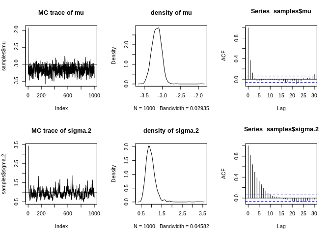

``` r
# n=1000, no_gibbs=1000
y<-data_y(n=1000,nu=2,mu=-3,sigma.2 = 1)
samples<-gibbs(1000,y,nu=2)
## posterior mean, median, 95% credible intervals of mu and sigma.2
mean (samples$mu)
```

    ## [1] -2.979635

``` r
quantile (samples$mu, probs = c(0.025, 0.5, 0.975))
```

    ##      2.5%       50%     97.5% 
    ## -3.064414 -2.982510 -2.892791

``` r
mean (samples$sigma.2)
```

    ## [1] 1.064093

``` r
quantile (samples$sigma.2, probs = c(0.025, 0.5, 0.975))
```

    ##      2.5%       50%     97.5% 
    ## 0.9193822 1.0573825 1.2174717

``` r
## plots
par (mfrow=c(2,3))
plot (samples$mu, main = "MC trace of mu", type = "l");abline(h=-3)
plot (density (samples$mu),,main = "density of mu")
acf (samples$mu)
plot (samples$sigma.2, main = "MC trace of sigma.2", type = "l");abline(h=1)
plot (density (samples$sigma.2),main = "density of sigma.2")
acf (samples$sigma.2)
```


``` r
# n=10000, no_gibbs=1000
y<-data_y(n=10000,nu=2,mu=-3,sigma.2 = 1)
samples<-gibbs(1000,y,nu=2)
## posterior mean, median, 95% credible intervals of mu and sigma.2
mean (samples$mu)
```

    ## [1] -2.985312

``` r
quantile (samples$mu, probs = c(0.025, 0.5, 0.975))
```

    ##      2.5%       50%     97.5% 
    ## -3.010311 -2.987259 -2.961892

``` r
mean (samples$sigma.2)
```

    ## [1] 0.9919496

``` r
quantile (samples$sigma.2, probs = c(0.025, 0.5, 0.975))
```

    ##      2.5%       50%     97.5% 
    ## 0.9388503 0.9838751 1.0427955

``` r
## plots
par (mfrow=c(2,3))
plot (samples$mu, main = "MC trace of mu", type = "l");abline(h=-3)
plot (density (samples$mu),,main = "density of mu")
acf (samples$mu)
plot (samples$sigma.2, main = "MC trace of sigma.2", type = "l");abline(h=1)
plot (density (samples$sigma.2),main = "density of sigma.2")
acf (samples$sigma.2)
```

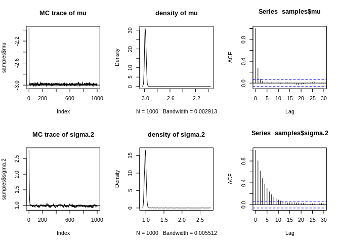

Test 2 (*ν* = 2, *μ* = 5, *σ*<sup>2</sup> = 2) with different number of n
-------------------------------------------------------------------------

``` r
# n=100, no_gibbs=1000
y<-data_y(n=100,nu=2,mu=5,sigma.2 = 2)
samples<-gibbs(1000,y,nu=2)
## posterior mean, median, 95% credible intervals of mu and sigma.2
mean (samples$mu)
```

    ## [1] 4.940561

``` r
quantile (samples$mu, probs = c(0.025, 0.5, 0.975))
```

    ##     2.5%      50%    97.5% 
    ## 4.639975 4.943510 5.264391

``` r
mean (samples$sigma.2)
```

    ## [1] 1.709032

``` r
quantile (samples$sigma.2, probs = c(0.025, 0.5, 0.975))
```

    ##     2.5%      50%    97.5% 
    ## 1.078881 1.643044 2.667237

``` r
## plots
par (mfrow=c(2,3))
plot (samples$mu, main = "MC trace of mu", type = "l");abline(h=5)
plot (density (samples$mu),,main = "density of mu")
acf (samples$mu)
plot (samples$sigma.2, main = "MC trace of sigma.2", type = "l");abline(h=2)
plot (density (samples$sigma.2),main = "density of sigma.2")
acf (samples$sigma.2)
```

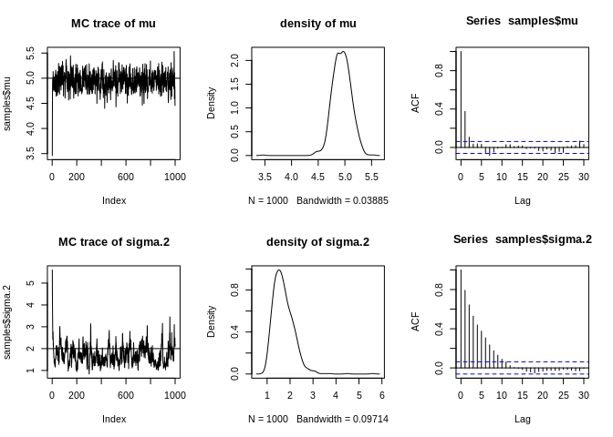

``` r
# n=1000, no_gibbs=1000
y<-data_y(n=1000,nu=2,mu=5,sigma.2 = 2)
samples<-gibbs(1000,y,nu=2)
## posterior mean, median, 95% credible intervals of mu and sigma.2
mean (samples$mu)
```

    ## [1] 4.979389

``` r
quantile (samples$mu, probs = c(0.025, 0.5, 0.975))
```

    ##     2.5%      50%    97.5% 
    ## 4.866852 4.979868 5.103729

``` r
mean (samples$sigma.2)
```

    ## [1] 2.089612

``` r
quantile (samples$sigma.2, probs = c(0.025, 0.5, 0.975))
```

    ##     2.5%      50%    97.5% 
    ## 1.832651 2.071036 2.364954

``` r
## plots
par (mfrow=c(2,3))
plot (samples$mu, main = "MC trace of mu", type = "l");abline(h=5)
plot (density (samples$mu),,main = "density of mu")
acf (samples$mu)
plot (samples$sigma.2, main = "MC trace of sigma.2", type = "l");abline(h=2)
plot (density (samples$sigma.2),main = "density of sigma.2")
acf (samples$sigma.2)
```

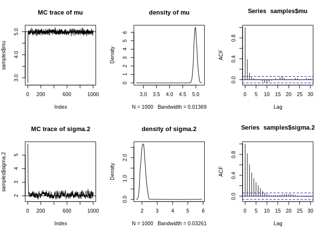

``` r
# n=10000, no_gibbs=1000
y<-data_y(n=10000,nu=2,mu=5,sigma.2 = 2)
samples<-gibbs(1000,y,nu=2)
## posterior mean, median, 95% credible intervals of mu and sigma.2
mean (samples$mu)
```

    ## [1] 5.033118

``` r
quantile (samples$mu, probs = c(0.025, 0.5, 0.975))
```

    ##     2.5%      50%    97.5% 
    ## 4.996724 5.035903 5.073950

``` r
mean (samples$sigma.2)
```

    ## [1] 2.049617

``` r
quantile (samples$sigma.2, probs = c(0.025, 0.5, 0.975))
```

    ##     2.5%      50%    97.5% 
    ## 1.937575 2.031594 2.130522

``` r
## plots
par (mfrow=c(2,3))
plot (samples$mu, main = "MC trace of mu", type = "l");abline(h=5)
plot (density (samples$mu),,main = "density of mu")
acf (samples$mu)
plot (samples$sigma.2, main = "MC trace of sigma.2", type = "l");abline(h=2)
plot (density (samples$sigma.2),main = "density of sigma.2")
acf (samples$sigma.2)
```

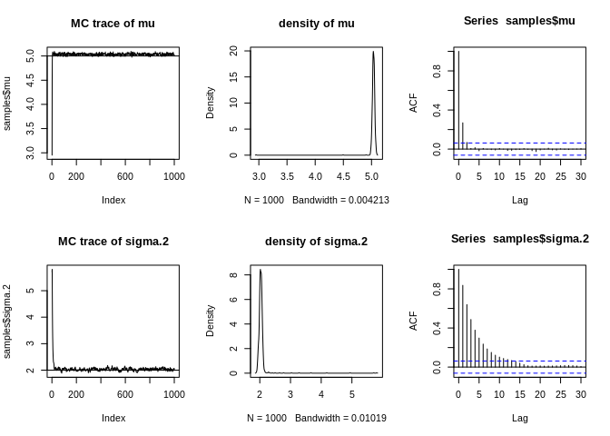

Compare with MLE found by nlm
-----------------------------

``` r
## MLE estimates found by nlm
neg_loglike <- function(b,y){
  n<-length(y)
  (2+1)/2*sum(log(1+(y-b[1])^2/(b[2]*2)))+n/2*log(b[2])
}

mle_nlm <- nlm (neg_loglike, c(3, 1.7) , y=y, hessian = T); mle_nlm
```

    ## $minimum
    ## [1] 12764.32
    ## 
    ## $estimate
    ## [1] 5.034870 2.034045
    ## 
    ## $gradient
    ## [1] -0.001257971  0.000111784
    ## 
    ## $hessian
    ##             [,1]       [,2]
    ## [1,] 2947.100621  -8.766899
    ## [2,]   -8.766899 483.906792
    ## 
    ## $code
    ## [1] 1
    ## 
    ## $iterations
    ## [1] 8

``` r
# hessian matrix 
mle_nlm$hessian
```

    ##             [,1]       [,2]
    ## [1,] 2947.100621  -8.766899
    ## [2,]   -8.766899 483.906792

``` r
# find MLE standard errors using hessian matrix of negative log likelihood from nlm
se.nlm <- sqrt (diag (solve(mle_nlm$hessian))); se.nlm
```

    ## [1] 0.01842104 0.04546015

``` r
# standard deviation of samples from gibbs sampling
sd (samples$mu);sd (samples$sigma.2)
```

    ## [1] 0.07084198

    ## [1] 0.2224193

``` r
# Compare se.nlm and standard deviation(sd) from gibbs sampling
compare <- data.frame(rbind(c(mean (samples$mu),mean (samples$sigma.2)),
                      mle_nlm$estimate,c(sd (samples$mu),sd(samples$sigma.2)),se.nlm),
                       row.names = c("gibbs","mle_nlm","gibbs_sd","se_nlm"))
colnames(compare) <- c("mu","sigma.2")
# for gibbs sampling, generate data from: y<-data_y(n=10000,nu=2,mu=5,sigma.2 = 2)
compare
```

<script data-pagedtable-source type="application/json">
{"columns":[{"label":[""],"name":["_rn_"],"type":[""],"align":["left"]},{"label":["mu"],"name":[1],"type":["dbl"],"align":["right"]},{"label":["sigma.2"],"name":[2],"type":["dbl"],"align":["right"]}],"data":[{"1":"5.03311758","2":"2.04961733","_rn_":"gibbs"},{"1":"5.03487048","2":"2.03404456","_rn_":"mle_nlm"},{"1":"0.07084198","2":"0.22241929","_rn_":"gibbs_sd"},{"1":"0.01842104","2":"0.04546015","_rn_":"se_nlm"}],"options":{"columns":{"min":{},"max":[10]},"rows":{"min":[10],"max":[10]},"pages":{}}}
  </script>

Question 2
==========

rstan
-----

``` r
## rstan
# generate data from: y<-data_y(n=10000,nu=2,mu=5,sigma.2 = 2)
library (rstan)
```

    ## Loading required package: StanHeaders

    ## Loading required package: ggplot2

    ## rstan (Version 2.19.2, GitRev: 2e1f913d3ca3)

    ## For execution on a local, multicore CPU with excess RAM we recommend calling
    ## options(mc.cores = parallel::detectCores()).
    ## To avoid recompilation of unchanged Stan programs, we recommend calling
    ## rstan_options(auto_write = TRUE)

``` r
code <- "
data {
  int<lower=1> n;
  real nu;
  vector[n] y;
  real<lower=0> alpha;
  real<lower=0> w;
}

parameters {
  vector<lower=0> [n] v;          
  real mu;
  real<lower = 0> sigma2;
}

model {
  for (i in 1:n){
    v[i]~inv_gamma(nu/2,nu*sigma2/2);
    y[i]~normal(mu,sqrt(v[i]));
  }
  mu~normal(0,10);
  sigma2~inv_gamma(alpha/2,alpha*w/2);
}
"

## either read external file .stan or read code
inits1<-list(v=rep(0.5,length(y)),mu=1,sigma2=0.1)
inits2<-list(v=rep(0.8,length(y)),mu=10,sigma2=5)
stanfit = stan(model_code=code, data=list(n=length(y),nu=2,y=y,alpha=1E-100,w=1),
                chains=2, warmup=500, iter=1000, save_warmup=T)
```

    ## 
    ## SAMPLING FOR MODEL '611a492c3fe4550f53b6724d9bbd6661' NOW (CHAIN 1).
    ## Chain 1: 
    ## Chain 1: Gradient evaluation took 0.002819 seconds
    ## Chain 1: 1000 transitions using 10 leapfrog steps per transition would take 28.19 seconds.
    ## Chain 1: Adjust your expectations accordingly!
    ## Chain 1: 
    ## Chain 1: 
    ## Chain 1: Iteration:   1 / 1000 [  0%]  (Warmup)
    ## Chain 1: Iteration: 100 / 1000 [ 10%]  (Warmup)
    ## Chain 1: Iteration: 200 / 1000 [ 20%]  (Warmup)
    ## Chain 1: Iteration: 300 / 1000 [ 30%]  (Warmup)
    ## Chain 1: Iteration: 400 / 1000 [ 40%]  (Warmup)
    ## Chain 1: Iteration: 500 / 1000 [ 50%]  (Warmup)
    ## Chain 1: Iteration: 501 / 1000 [ 50%]  (Sampling)
    ## Chain 1: Iteration: 600 / 1000 [ 60%]  (Sampling)
    ## Chain 1: Iteration: 700 / 1000 [ 70%]  (Sampling)
    ## Chain 1: Iteration: 800 / 1000 [ 80%]  (Sampling)
    ## Chain 1: Iteration: 900 / 1000 [ 90%]  (Sampling)
    ## Chain 1: Iteration: 1000 / 1000 [100%]  (Sampling)
    ## Chain 1: 
    ## Chain 1:  Elapsed Time: 101.183 seconds (Warm-up)
    ## Chain 1:                25.0635 seconds (Sampling)
    ## Chain 1:                126.246 seconds (Total)
    ## Chain 1: 
    ## 
    ## SAMPLING FOR MODEL '611a492c3fe4550f53b6724d9bbd6661' NOW (CHAIN 2).
    ## Chain 2: 
    ## Chain 2: Gradient evaluation took 0.001558 seconds
    ## Chain 2: 1000 transitions using 10 leapfrog steps per transition would take 15.58 seconds.
    ## Chain 2: Adjust your expectations accordingly!
    ## Chain 2: 
    ## Chain 2: 
    ## Chain 2: Iteration:   1 / 1000 [  0%]  (Warmup)
    ## Chain 2: Iteration: 100 / 1000 [ 10%]  (Warmup)
    ## Chain 2: Iteration: 200 / 1000 [ 20%]  (Warmup)
    ## Chain 2: Iteration: 300 / 1000 [ 30%]  (Warmup)
    ## Chain 2: Iteration: 400 / 1000 [ 40%]  (Warmup)
    ## Chain 2: Iteration: 500 / 1000 [ 50%]  (Warmup)
    ## Chain 2: Iteration: 501 / 1000 [ 50%]  (Sampling)
    ## Chain 2: Iteration: 600 / 1000 [ 60%]  (Sampling)
    ## Chain 2: Iteration: 700 / 1000 [ 70%]  (Sampling)
    ## Chain 2: Iteration: 800 / 1000 [ 80%]  (Sampling)
    ## Chain 2: Iteration: 900 / 1000 [ 90%]  (Sampling)
    ## Chain 2: Iteration: 1000 / 1000 [100%]  (Sampling)
    ## Chain 2: 
    ## Chain 2:  Elapsed Time: 97.8399 seconds (Warm-up)
    ## Chain 2:                24.9208 seconds (Sampling)
    ## Chain 2:                122.761 seconds (Total)
    ## Chain 2:

    ## Warning: Bulk Effective Samples Size (ESS) is too low, indicating posterior means and medians may be unreliable.
    ## Running the chains for more iterations may help. See
    ## http://mc-stan.org/misc/warnings.html#bulk-ess

    ## Warning: Tail Effective Samples Size (ESS) is too low, indicating posterior variances and tail quantiles may be unreliable.
    ## Running the chains for more iterations may help. See
    ## http://mc-stan.org/misc/warnings.html#tail-ess

``` r
print(stanfit, digits=2,pars=c("mu","sigma2"),probs=c(0.025, 0.5, 0.975)) 
```

    ## Inference for Stan model: 611a492c3fe4550f53b6724d9bbd6661.
    ## 2 chains, each with iter=1000; warmup=500; thin=1; 
    ## post-warmup draws per chain=500, total post-warmup draws=1000.
    ## 
    ##        mean se_mean   sd 2.5%  50% 97.5% n_eff Rhat
    ## mu     5.04       0 0.02 5.00 5.04  5.07   634 1.01
    ## sigma2 2.03       0 0.05 1.95 2.03  2.13   205 1.00
    ## 
    ## Samples were drawn using NUTS(diag_e) at Mon Oct  7 23:58:35 2019.
    ## For each parameter, n_eff is a crude measure of effective sample size,
    ## and Rhat is the potential scale reduction factor on split chains (at 
    ## convergence, Rhat=1).

``` r
traceplot(stanfit,pars=c("mu","sigma2"), inc_warmup = T)
```

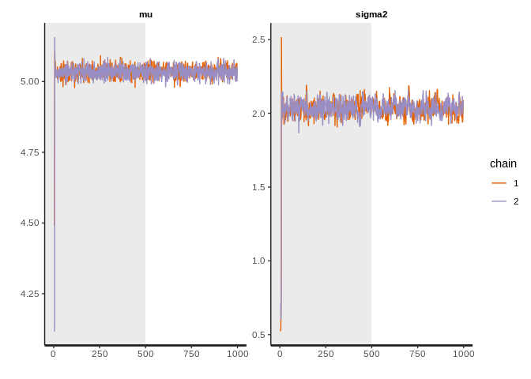

``` r
pairs(stanfit,pars=c("mu","sigma2"))
```

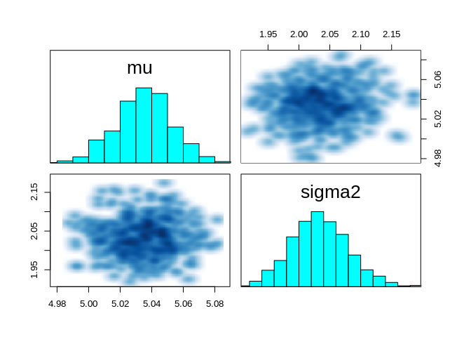

JAGS
----

``` r
## rjags
# generate data from: y<-data_y(n=10000,nu=2,mu=5,sigma.2 = 2)
library ("R2jags")
```

    ## Loading required package: rjags

    ## Loading required package: coda

    ## 
    ## Attaching package: 'coda'

    ## The following object is masked from 'package:rstan':
    ## 
    ##     traceplot

    ## Linked to JAGS 4.3.0

    ## Loaded modules: basemod,bugs

    ## 
    ## Attaching package: 'R2jags'

    ## The following object is masked from 'package:coda':
    ## 
    ##     traceplot

    ## The following object is masked from 'package:rstan':
    ## 
    ##     traceplot

``` r
model_jags <- "
model{
  mu ~ dnorm(0,0.01)
  isigma2 ~ dgamma(alpha/2,alpha*w/2)
  sigma2 <-1/isigma2
  for (i in 1:n){
    iv[i] ~ dgamma(nu/2,nu*sigma2/2)
    v[i] <- 1/iv[i]
    y[i] ~ dnorm(mu,1/v[i])
  }
}
"
write (model_jags, file = "model.bug")
data <- list (y=y,n=length(y), nu = 2,alpha=1E-100,w=1)
# define a function to generate initial values for parameters
inits <- function ()
{
  list (mu = rnorm (1), isigma2 = runif(1,1,10))
}
# call jags to simulate MCMC
jagfit <- jags (model.file = "model.bug",
              data = data, inits = inits, 
              parameters = c("mu", "sigma2"),
              n.chains = 2, n.thin = 1, n.burnin = 500, n.iter = 1000)
```

    ## module glm loaded

    ## Compiling model graph
    ##    Resolving undeclared variables
    ##    Allocating nodes
    ## Graph information:
    ##    Observed stochastic nodes: 10000
    ##    Unobserved stochastic nodes: 10002
    ##    Total graph size: 40016
    ## 
    ## Initializing model

``` r
jagfit
```

    ## Inference for Bugs model at "model.bug", fit using jags,
    ##  2 chains, each with 1000 iterations (first 500 discarded)
    ##  n.sims = 1000 iterations saved
    ##            mu.vect sd.vect      2.5%       25%       50%       75%
    ## mu           5.033   0.019     4.997     5.021     5.034     5.045
    ## sigma2       2.020   0.042     1.932     1.996     2.021     2.048
    ## deviance 41237.527 104.293 41027.434 41168.298 41240.770 41307.606
    ##              97.5%  Rhat n.eff
    ## mu           5.069 1.012   120
    ## sigma2       2.098 1.042    42
    ## deviance 41437.969 1.032    52
    ## 
    ## For each parameter, n.eff is a crude measure of effective sample size,
    ## and Rhat is the potential scale reduction factor (at convergence, Rhat=1).
    ## 
    ## DIC info (using the rule, pD = var(deviance)/2)
    ## pD = 5336.9 and DIC = 46574.4
    ## DIC is an estimate of expected predictive error (lower deviance is better).

``` r
traceplot (jagfit)
```

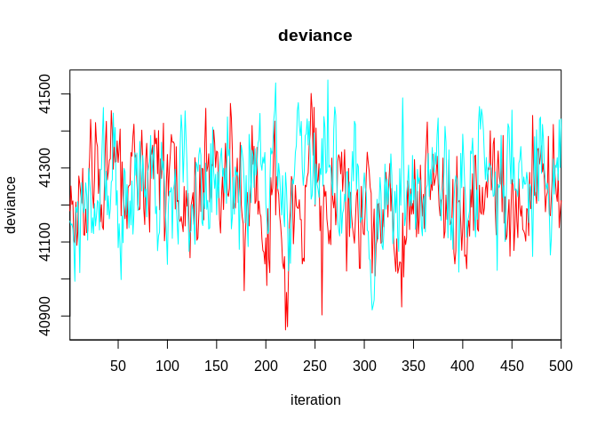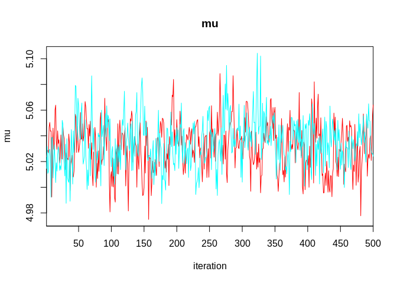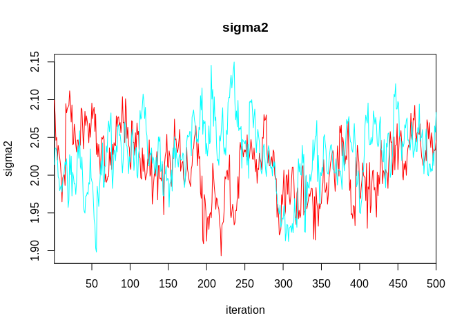

``` r
# convert to MCMC object
jagfit.mcmc <- as.mcmc (jagfit) 
summary (jagfit.mcmc)
```

    ## 
    ## Iterations = 501:1000
    ## Thinning interval = 1 
    ## Number of chains = 2 
    ## Sample size per chain = 500 
    ## 
    ## 1. Empirical mean and standard deviation for each variable,
    ##    plus standard error of the mean:
    ## 
    ##               Mean        SD  Naive SE Time-series SE
    ## deviance 41237.527 104.29309 3.2980370       7.309616
    ## mu           5.033   0.01861 0.0005884       0.001225
    ## sigma2       2.020   0.04230 0.0013375       0.005324
    ## 
    ## 2. Quantiles for each variable:
    ## 
    ##               2.5%       25%       50%       75%     97.5%
    ## deviance 41027.434 41168.298 41240.770 41307.606 41437.969
    ## mu           4.997     5.021     5.034     5.045     5.069
    ## sigma2       1.932     1.996     2.021     2.048     2.098

``` r
# the first chain
chain1 <- jagfit.mcmc[[1]]
# plot
plot(chain1[,2:3])
```

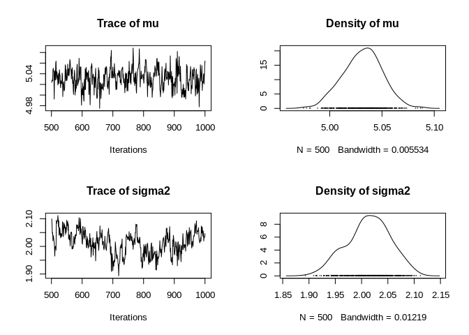

``` r
# all chains
jagfit.matrix <- as.matrix (jagfit.mcmc)
# scatterplot
plot(jagfit.matrix[,2:3])
```

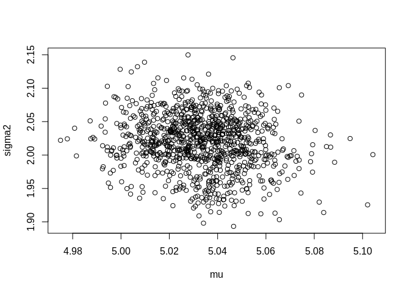

Comments for both Q1 and Q2
---------------------------

From test 1 and test 2, R function - gibbs got close estimates as true
values. As n (sample size) increases, the estimates getting closer to
true values and with smaller variances for samples. Compared with MLE
estimates found by nlm with a defined objective function (used log-t
here), the estimates are close but nlm has samller standard error.

Using blackbox like jags and rstan, it will be more efficient, and the
starndard deviation for posterior samples are smaller. Also, rstan got
smaller standard error than jags but more time consuming.
